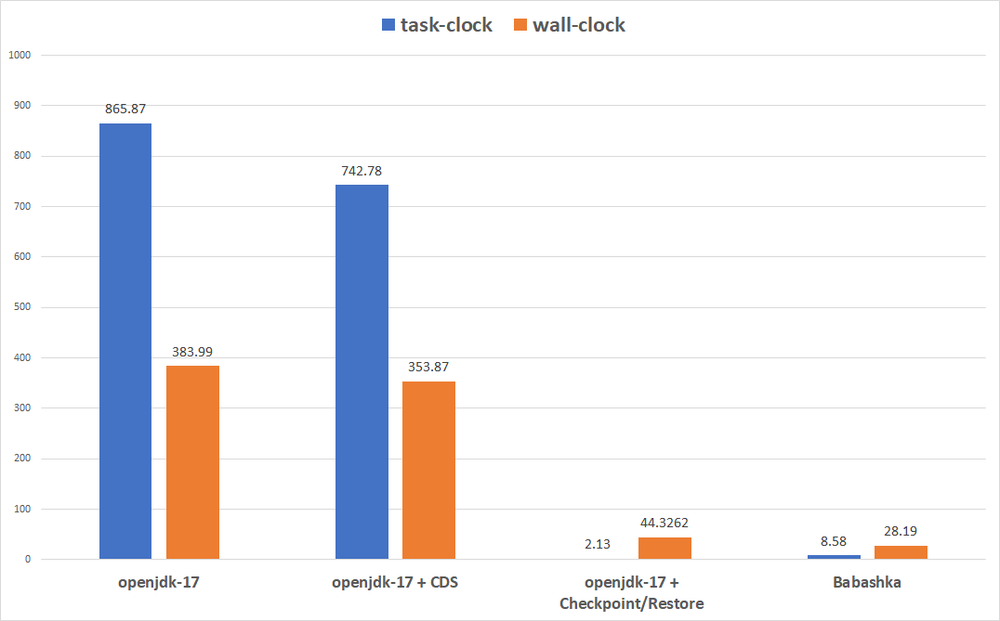

# Fast Starting JVM Clojure with Checkpoint/Restore (Part 1)

It is well-known that Clojure has a long startup time. Even with years of improvement on the JVM and Clojure itself, getting to the REPL still takes seconds. This makes JVM Clojure unsuitable for short-living programs, such as command lines utilities.

Then there is [Babashka](https://github.com/babashka/babashka), which starts instantly and works *mostly* like JVM Clojure. In Babashka, there is no JVM, instead [a custom interpreter](https://github.com/borkdude/sci) runs your Clojure Code.[^1] You can't use Java classes except those built into with Babashka. Existing Clojure libraries may or may not work depending on what Java classes they use underneath. Babashka is great for simple scripts, but comes short when you need third-party libraries.

Why do we have to choose between *Clojure that works for everything* and *Clojure that starts fast*? If only we could combine the power of JVM Clojure and the speed of Babashka...

## Why is Clojure slow to start?

So why is Clojure on the JVM slow to start? I recommand reading [this](https://clojure-goes-fast.com/blog/clojures-slow-start/) if you're interested in the details, but the TL;DR is that **it takes a lot of time to initialize `clojure.core` namespace**. In JVM's term, that means running a bunch of static initialization. Every top-level form in Clojure corresponds to a static field initialized within static initialization blocks.

We can test it by compiling a small Clojure program into bytecode. Here's `src/hello.clj`:

```clojure
(ns hello)

(defn hello-world
  []
  (println "Hello world!"))
```

Run `clj -M -e "(compile 'hello)"` produces *4* `.class` files for the `hello` namespace on my computer:

```
hello$fn__128.class
hello$hello_world.class
hello$loading__6789__auto____126.class
hello__init.class
```

Using [Intellij's Java decompiler](https://mvnrepository.com/artifact/com.jetbrains.intellij.java/java-decompiler-engine), we can take a look at what these `.class` files contain. Here's `hello__init.java`:

```
public class hello__init {
   public static final Var const__0;
   public static final AFn const__1;
   public static final AFn const__2;
   public static final Var const__3;
   public static final AFn const__11;

   public static void load() {
      ((IFn)const__0.getRawRoot()).invoke(const__1);
      ((IFn)(new hello$loading__6789__auto____126())).invoke();
      Object var10002;
      if (((Symbol)const__1).equals(const__2)) {
         var10002 = null;
      } else {
         LockingTransaction.runInTransaction((Callable)(new hello$fn__128()));
         var10002 = null;
      }

      Var var10003 = const__3;
      var10003.setMeta((IPersistentMap)const__11);
      var10003.bindRoot(new hello$hello_world());
   }

   public static void __init0() {
      const__0 = (Var)RT.var("clojure.core", "in-ns");
      const__1 = (AFn)Symbol.intern((String)null, "hello");
      const__2 = (AFn)Symbol.intern((String)null, "clojure.core");
      const__3 = (Var)RT.var("hello", "hello-world");
      const__11 = (AFn)RT.map(new Object[]{RT.keyword((String)null, "arglists"), PersistentList.create(Arrays.asList(Tuple.create())), RT.keyword((String)null, "line"), 3, RT.keyword((String)null, "column"), 1, RT.keyword((String)null, "file"), "hello.clj"});
   }

   static {
      __init0();
      Compiler.pushNSandLoader(RT.classForName("hello__init").getClassLoader());

      try {
         load();
      } catch (Throwable var1) {
         Var.popThreadBindings();
         throw var1;
      }

      Var.popThreadBindings();
   }
}
```

The `hello__init` class contains 5 static variables, representing Clojure functions and variables. The static initialization block calls `__init0()`, which sets up the static variables.

Remember that `clojure.core` containing over 600 functions and variables! This initialization takes place every time you launch a new REPL or run a script with Clojure, and is the major cause for Clojure's slow start.

## A promising solution: Checkpoint/Restore

[CRIU](https://criu.org/), which stands for Checkpoint/Restore In Userspace, is a linux tool that can freezes a running program and saves ("checkpoint") its state to disk. The saved state can then be restored later multiple times, potentially on a different machine. CRIU can be applied to any Linux programs, including the JVM. [CRaC](https://github.com/CRaC/docs), which stands for Coordinated Restore at Checkpoint, is an OpenJDK side-project that adds support for Checkpoint/Restore from the JVM. It exposes an API for triggering or reacting to Checkpoint/Restore, runs heap cleanup and compaction prior to calling CRIU, checks for open file handles and sockets, and more.

The plan of attack is simple. We initialize Clojure once, and request a checkpoint via CRaC. Later, when we want a Clojure REPL, we ask CRaC to restore JVM from the checkpoint. The restore process is fast, and from now everything works exactly the same as normal JVM Clojure -- JIT compilation, dymanic class loading, etc.

Here's a step-by-step guide if you want to try for yourself. I plan to package the whole thing into something like docker eventually, but for now you'll have to do it manually.

1. Download [the latest build of JDK with CRaC](https://github.com/CRaC/openjdk-builds/releases). Unpack it with `sudo` (`sudo` is necessary because `criu` is a setuid executable).
2. Download [Clojure as a JAR file](https://clojure.org/releases/downloads). I'll use 1.8 for the experiment and benchmark.
3. Run `<your-JDK-dir>/bin/java -cp clojure-1.8.0.jar -XX:CRaCCheckpointTo=my_checkpoint clojure.main -e '(jdk.crac.Core/checkpointRestore)'`. We're telling Clojure to request a checkpoint immediately upon finishing initialization (via `jdk.crac.Core/checkpointRestore`). The checkpoint will be saved in `my_checkpoint/`.
4. When we want a Clojure REPL, run `<your-JDK-dir>/bin/java -XX:CRaCRestoreFrom=my_checkpoint clojure.main`. This will restore the checkpoint and transfer control to `clojure.main`, which starts a fresh REPL.

Notes:
* You may pass extra command line arguments when restoring the checkpoint. Those arguments are forwarded to `clojure.main`. For example, to execute `src/core.clj`, you may run `<your-JDK-dir>/bin/java -XX:CRaCRestoreFrom=my_checkpoint clojure.main src/core.clj`.[^4]
* The checkpoint refers to the original `clojure-1.8.0.jar` by absolute path. You need to make sure it stays where it is when you restore the checkpoint.
* By default, the checkpoint is not portable across machines and Linux distros. There are ways to make it portable[^2], and hopeful this will improve as the project matures.
* You may initialize additional namespaces by calling `require` (or doing any sort of JVM warm up, really) before calling `jdk.crac.Core/checkpointRestore`, which can further reduce startup time depending on your use case.

## Benchmark

We'll benchmark the time it takes to finish executing `(println "Hello world!")` for the following Clojure runtimes:

* `openjdk-17-crac+5`
* `openjdk-17-crac+5` with dynamic CDS enabled[^3]
* `openjdk-17-crac+5` with Checkpoint/Restore
* Babashka v1.3.182

Performance is measured with `perf stat -e task-clock -r50`. I ran the benchmark on my laptop with a 3.20 GHz AMD Ryzen 7 5800H in a NixOS VM.

Here's the result:



Some observations:

* Checkpoint/Restore starts up very fast, on par with Babashka
* With OpenJDK (both with CDS and without CDS), task-clock is 2~3x wall clock, indicating efficient usage of multiple CPU cores. Not so with Checkpoint/Restore or Babashka
* For Checkpoint/Restore and Babashka, the hello-world example finishes within milliseconds, and this benchmark is probably not accurate any more. You should not use the result of this benchmark to compare the performance between Checkpoint/Restore and Babashka.

Let's also run through file sizes:

* `clojure-1.8.0.jar` is 3.5MB
* `my_checkpoint` is 43MB, about 12x larger than `clojure-1.8.0.jar`
* `babashka-1.3.182` is a 86MB standalone executable, which does not depend on JVM

## Conclusion

Checkpoint/Restore is a promising technique to improve Clojure startup time without sacraficing power. CRaC is still in early stage of development, and we can expect constant improvement from now on.

The next post will be about integrating Checkpoint/Restore with tools.deps and the Clojure CLI tools. Stay tuned!

[^1]: Babashka uses [GraalVM Native Image](https://www.graalvm.org/) to compile Java bytecode into native code ahead-of-time. This process requires that all the bytecode called at run time must be known (observed and analyzed) at build time (known as the "closed world assumption"). Normally, Clojure compiles your code into Java bytecode and loads them into the JVM on the fly, but this is not possible with GraalVM Native Image. As a workaround, Babashka embeds a Clojure interpreter to evaluate Clojure code directly without compiling to Java bytecode.

[^2]: https://cr.openjdk.org/~heidinga/crac/Portability_of_checkpoints.pdf

[^3]: https://docs.oracle.com/en/java/javase/17/vm/class-data-sharing.html

[^4]: There's currently a bug where if you pass `-e '(println "Hello world!")'` as arguments, Clojure will see only `-e '(println` and treat whitespace as EOF. A workaround is to use `\n` instead of whitespace, like so: `-e $'(println\n"Hello-world!")'`